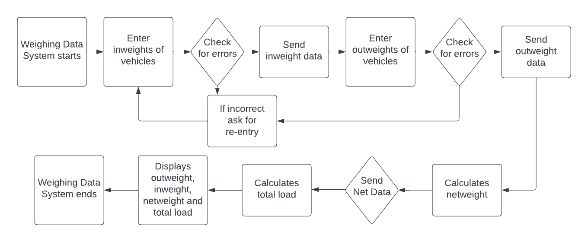
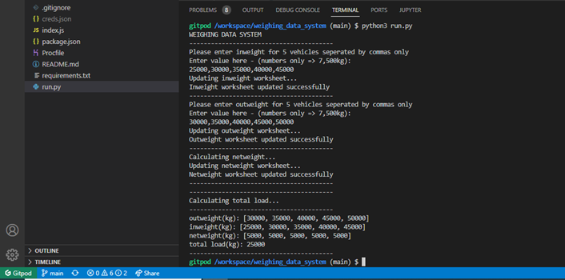

# Weighing Data System

Weighing Data System is a terminal application that allows the user to input the inweight of vehicles that coming into a site and input the outweights of a vehicles leaving site. The system then calculates the netweight of each vehicle and the total load of vehicles that have been in and out of site for that period (this system is based on 5 vehicles per period weighed in kg). The data logged for inweight, outweight and netweight is then parsed to google sheets for record keeping and further analysis. 

 

<strong><u>STRATEGY</u></strong>

Focus - What’s worth doing? 
Allow the user to input weight of vehicles arriving and leaving sites, calculate netweight and total load the parse the data.  
Definition - What are we creating? 
A terminal application that allows the user to address a real-life need – inputting and analyzing data in the weighing industry.  
Value - What value does it provide? 
It allows a user to log known weights of vehicles arriving and leaving site and calculates netweights which can then be exported into a format that can then be fed into their own internal system. 

<strong><u>SCOPE</u></strong>

What features will be available? 
There will be two input requests for the user asking for 5 inweights as the vehicles are arriving onsite and 5 outweights as the vehicles are leaving site. The user will then be able to upload the data to google sheets and will be notified of total load.

<strong><u>STRUCTURE</u></strong>

How is the user interaction designed? 
At the top of the terminal will be the title of the application Weighing Data System. The user will then be asked to input the 5 inweights which will give an error if the values entered aren’t integers or in the correct format. The user will then be notified if the inweight data has been successfully uploaded to google sheets. Next, the user will be asked to input 5 outweights which will also give an error if the values entered aren’t integers or in the correct format. The user will then be notified if the outweight data has been successfully uploaded to google sheets. The app will then calculate netweight from outweights minus inweights and notofy the user when the netweight data has been successfully uploaded to google sheets. The app will then calculate total load by adding the 5 netweights then printing each of the outweights, inweights, netweights and finally total load. 

 

<strong><u>SKELETON</u></strong>

How will the interface be laid out? 
Command-line interface with step by step instructions for user to follow and notifications of outputs. 

 

<strong><u>SURFACE</u></strong>

What will the visual design look like? 

 

<strong><u>FUTURE RELEASES</u></strong>

What features would you like to have in the future? 
Allow the user to select how many vehicles they will have coming to and leaving site for the given period and select the minimum weight for the vehicle.

<strong><u>TECHNOLOGY</u></strong>

What technology was used? 
<ul>
<li>Gitpod</li>
<li>Github</li>
<li>Python</li>
<li>Google API</li>
<li>Heroku</li>
<li>Nodejs</li>
</ul>

<strong><u>TESTING</u></strong>

How was the site tested and are there any bugs that have not been addressed? 
Bug was found upon opening workspace on different device after a previously successful test, commit and push.  Error messages - Unable to import gspread and Unable to import google.oauth2.service_account.  

 

Investigated on stack overflow and ran:
<ul>
<li>pip install --upgrade google-auth google-auth-httplib2 google-api-python-client</li>
<li>pip install gspread</li>
<li>uploaded creds.json </li>
</ul>

Program tested fine afterwards though this bug kept happening upon opening workspace on different devices . 

 

Program still requires the pip installs and creds.json upload upon opening workspace on new device.

Tested code manually on https://www.pythonchecker.com/  with no major errors and a 96% mark. Minor issues are no whitespaces around operators.

<strong><u>DEPLOYMENT</u></strong>

How was the project deployed? 
The project was deployed on Heroku. The steps to deploy are as follows: 
<ul>
<li>Create new Heroku app</li>
<li>Link Heroku app to repository</li>
<li>Select Deploy</li>
</ul>

<strong><u>CREDITS</u></strong>

Code Institute - https://codeinstitute.net/ 
Stack Overflow - https://stackoverflow.com/
